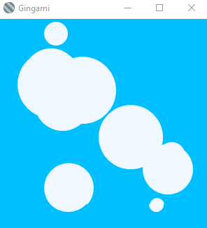

# Gingami
GDI+ is not game middleware! But let's try to use it as something like that anyway.

## Overview
Gingami (**G**DI+ **i**s **n**ot **ga**me **mi**ddleware) is a starter project for building 2D (or 3D, I suppose, if you fancy coding it up) game engines using [GDI+](https://docs.microsoft.com/en-us/windows/desktop/gdiplus/-gdiplus-gdi-start) from a .NET C# Windows Forms application. I put this together [following this VB.NET article](https://www.codeproject.com/Articles/409988/%2FArticles%2F409988%2FBeginners-Starting-a-2D-Game-with-GDIplus) because I fancy building a game soon (maybe) and I'm pretty unfamiliar with just about everything to do with game development, but very familiar with Windows Forms and GDI+.

## What's in the Box?
In this project, you get:

* A single Windows form, configured to draw on with minimal flicker at maximum frames per second (I get about 90).
* A framerate counter, that's going to be drawn in the upper left-hand corner of the Window unless you get rid of it (there's a form-level boolean variable called `_showFps` that you can toggle to `false`).
* A load of randomised, bouncing 2D circles to give you some idea of performance (100 of them by default).

## Building
You'll need Visual Studio 2017 installed to build the executable. Just build it like any other C# WinForms solution.

## Contributing
If you'd like to contribute, feel free to fork and submit a PR or raise an issue. All feedback is welcome.

## Acknowledgements
The core of this thing is heavily informed by [this VB.NET article](https://www.codeproject.com/Articles/409988/%2FArticles%2F409988%2FBeginners-Starting-a-2D-Game-with-GDIplus) over on CodeProject.
